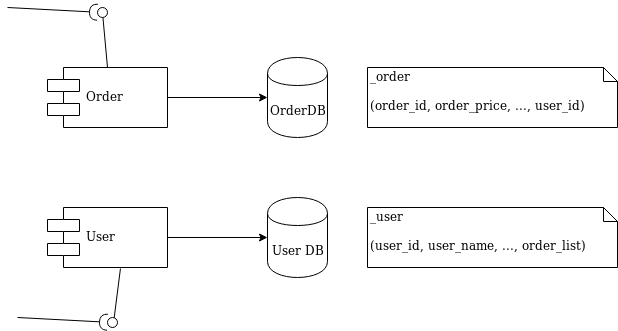
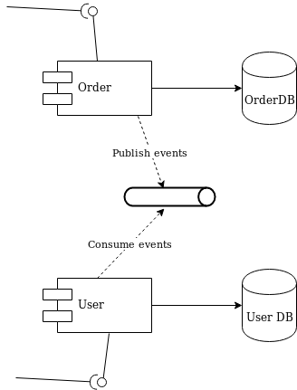
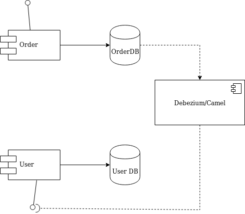

# Article notes

The rise of microservices oriented architecture brought us new development paradigms and mantra about independent development and decoupling. In such scenario we have to deal with a situation where we aim for independency but still we need to be notified and react about state changes in different domains of the enterprise.

I'll use a simple and typical example in order to understand what we're talking about. Let's imagine the development of two independent microservices, **Order** and **User** that must serve certain business logic and we designed them to be completely independent. We have a microservice for each that is exposing a REST interface that can be used to trigger any action, and each has its own database.



The **User** domain must be notified when some **Order** is processed or altered in order to consistently do some action, for example, update the reference list that each _User_ is tracking. You typically end up adding a queue in order to publish the **Order** events that will finally be processed by a **User**.



Fair design, but if you don't use the right development tools you will start to mix a lot of _infrastructure code_ into your _domain logic_ as you have to deal with queues now. You also will have to take care of transactions as you need to make sure that every event ends up correctly both in the **Order** database and in the queue.

Now, let me introduce an alternative solution that is going to handle all that work for you without touching any line of code of your **Order** and **User** microservices. I'll use Debezium and Camel in order to capture data changes happening in **Order** domain and then trigger certain actions to perform the update on the **User** domain.
[Debezium](https://debezium.io/) is a log-based change data capture middleware and [Camel](https://camel.apache.org/) an integration framework that will simplify the integration between the source (data changes captured by Debezium) and the destination (the REST API).



From the diagram you can see that Debezium is in charge to capture any data change happening on the **Order** domain and publish to a topic. Then a consumer is going to pick that event and make a REST call to the **User** API to perform the necessary action expected by its domain (update the list in our simple case): Camel will take care of the integration part.

```
public class MyRouteBuilder extends RouteBuilder {

    public void configure() {
        from("debezium:mysql?name=my-sql-connector"
                + "&databaseServerId=1"
                + "&databaseHostName=localhost"
                + "&databaseUser=debezium"
                + "&databasePassword=dbz"
                + "&databaseServerName=my-app-connector"
                + "&databaseHistoryFileName=/tmp/dbhistory.dat"
                + "&databaseWhitelist=debezium"
                + "&tableWhitelist=debezium._order"
                + "&offsetStorageFileName=/tmp/offset.dat")
                .choice()
                    .when(header(DebeziumConstants.HEADER_OPERATION).isEqualTo("c"))
                        .process(new AfterStructToOrderTranslator())
                        .to("rest-swagger:http://localhost:8082/v2/api-docs#addOrderUsingPOST")
                    .when(header(DebeziumConstants.HEADER_OPERATION).isEqualTo("d"))
                        .process(new BeforeStructToOrderTranslator())
                        .to("rest-swagger:http://localhost:8082/v2/api-docs#deleteOrderUsingDELETE")
                .log("Response : ${body}");
    }

}
```
That's it. Really. We don't need anything else apart that. Apache Camel has a [debezium component](https://camel.apache.org/components/latest/debezium-component.html) that is able to hook up a Mysql database and use [Debezium embedded engine](https://debezium.io/documentation/reference/0.9/operations/embedded.html). The source endpoint configuration is in fact providing the parameters needed by Debezium to look any change happening on the `debezium._order` table (available at localhost in the example).

Debezium will take care to stream the events according to a json defined format, so you know what kind of [information to expect](https://debezium.io/documentation/reference/0.10/connectors/mysql.html#events). It's worth to mention that for each event you will get the information as it was `before` and `after` the event to occur, plus a few useful meta information (that you can configure according your needs) such as the operation (create, delete, update, ...). 

Thanks to Camel content based router we will be able to either call the `addOrderUsingPOST` or `deleteOrderUsingDELETE` operation provided by the **User** REST API deployed on `localhost:8082`. The only programming we have to perform is represented by a message translator in order to convert the message format coming from Debezium to the json body expected by the REST call:

```
public class AfterStructToOrderTranslator implements Processor {

    private static final String EXPECTED_BODY_FORMAT = "{\"userId\":%d,\"orderId\":%d}";

    public void process(Exchange exchange) throws Exception {
        final Map value = exchange.getMessage().getBody(Map.class);
        // Convert and set body
        int userId = (int) value.get("user_id");
        int orderId = (int) value.get("order_id");

        exchange.getIn().setHeader("userId", userId);
        exchange.getIn().setHeader("orderId", orderId);
        exchange.getIn().setBody(String.format(EXPECTED_BODY_FORMAT, userId, orderId));
    }
}
```
You can notice that we did not touch at all the base code of **Order** or **User**. You can also turn off the Debezium process to simulate a downtime, and you will see that it will be able to recover all events as soon as it turn up again!

You can run the example provided by [following the instructions](https://github.com/squakez/debezium-camel-demo/blob/master/README.md).

## Caveat

The example illustrated here is using the embedded mode offered by Debezium. For more consistent solutions you should think to use the `Kafka connect` mode instead or [tuning the embedded engine](https://debezium.io/documentation/reference/0.10/operations/embedded.html#_handling_failures) accordingly.
